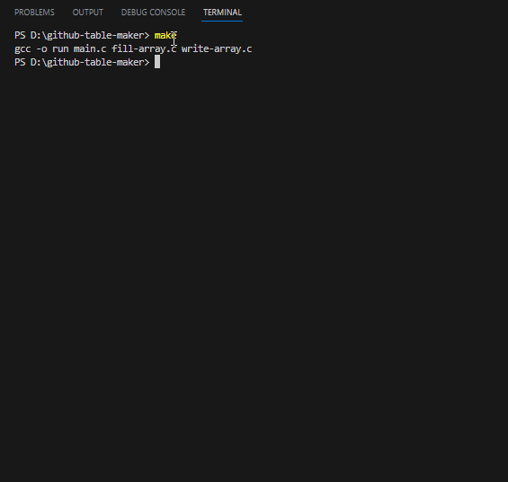

## Github Table Maker
You can make table with user defined character size, length of row and coloumn.

Copy output of the terminal and paste in to your README.md file.

| Hello | Github | This is | a test table | Enjoy ! |
| - | - | - | - | - |
| test | test | test | test | test |
| test | test | test | test | test |
| test | test | test | test | test | 
| test | test | test | test | test |

###  Install
```
- make
```
## Output


###  Author
```
Emre KOZALTI
github.com/emrekz
```